<h1 style="color:#44AEFB; margin:0;">
  💻 Jake Rose
  
</h1>

👋 Hey there! I'm a software developer passionate about building innovative and user-friendly projects. I have experience in full-stack development, test automation, and game development, working primarily with C#, JavaScript, and React.

My goal is to create applications that enhance accessibility and improve user experience. I’m always seeking ways to optimise workflows, write clean code, and build efficient solutions.

Outside of coding, I stay active with lots of climbing and love to immerse myself in horror novels and classic literature. Some of my favourite authors include Robert McCammon, Stephen King, Ray Bradbury, and H.G. Wells.
 

[Email Me](mailto:rosejake400@gmail.com)

    
 

<!-- Languages and Tools -->
<h2 style="color: #44AEFB">🛠️ Languages and Tools</h2>

    

<!-- Icons: self-contained animated tech-stack strip (gentle wave + pulse) -->
<!-- Source SVG: ./tech-stack.svg  •  Icon artwork: https://devicon.dev/ -->

  

 

<!-- Statistics -->
<h2 style="color: #44AEFB">📊 Statistics</h2>

<!-- Begin Stats Cards -->
<!-- Resources:  -->
<!-- Github & Languages Stats: https://github.com/anuraghazra/github-readme-stats --> 
<!-- Streak Stats: https://github.com/denvercoder1/github-readme-streak-stats -->
<!-- Both cards rendered at a matching height so they align evenly side by side. -->

  
  &nbsp;&nbsp;
  

<!--  End Stats Cards -->

---

<!-- 
🔗 Links 🔗
- My Github Portfolio Page:
https://github.com/Jake2508
- Github & Languages Stats Cards:
https://github.com/anuraghazra/github...
- Streak Stats Card:
https://github.com/denvercoder1/githu...
- SVG Icons Resource1:
https://devicon.dev/
