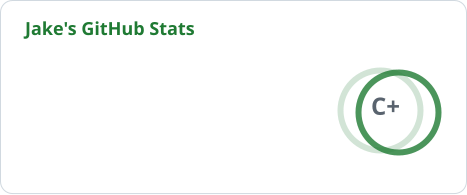
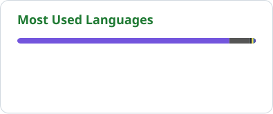

<!-- ==================== Header / hero ==================== -->
<h1>
  
  <picture>
    <source media="(prefers-color-scheme: dark)" srcset="./assets/header.svg">
    
  </picture>
</h1>

👋 Hi, I'm Jake, a C# developer experienced in building internal tools, services, automation pipelines and games. I've worked across software development, games and QA, with an interest in creative software and visual design.

Outside of coding, I stay active with lots of climbing and love to immerse myself in horror novels and classic literature. Some of my favourite authors include Robert McCammon, Stephen King, Ray Bradbury, and H.G. Wells.

 

<!-- ==================== Languages and Tools ==================== -->
<h2>
  <picture>
    <source media="(prefers-color-scheme: dark)" srcset="./assets/heading-languages.svg">
    
  </picture>
</h2>

<!-- Icons: self-contained animated tech-stack strip (gentle wave + pulse) -->
<!-- Source SVG: ./assets/tech-stack.svg  
•  Icon artwork: https://devicon.dev/ -->

  

 

<!-- ==================== Statistics ==================== -->
<h2>
  <picture>
    <source media="(prefers-color-scheme: dark)" srcset="./assets/heading-statistics.svg">
    
  </picture>
</h2>

<!-- Begin Stats Cards -->
<!-- Github & Languages Stats: https://github.com/anuraghazra/github-readme-stats -->
<!-- Both cards shown at height 165 (the languages card's natural height), which makes them
     the same size (395x165) and keeps the pair (~800px) inside GitHub's ~830px README column.
     At 175 they need ~846px and wrap onto two lines. -->
<!-- Each card has a dark and a light version (see update-stats.yml), like the headings above. -->

  <picture>
    <source media="(prefers-color-scheme: dark)" srcset="./assets/github-stats.svg">
    
  </picture>
  &nbsp;&nbsp;
  <picture>
    <source media="(prefers-color-scheme: dark)" srcset="./assets/top-langs.svg">
    
  </picture>

<!--  End Stats Cards -->

<!--
🔗 Links 🔗
- My Github Portfolio Page:
  https://github.com/Jake2508
- Github & Languages Stats Cards:
  https://github.com/anuraghazra/github-readme-stats
- SVG Icons Resource:
  https://devicon.dev/
-->
